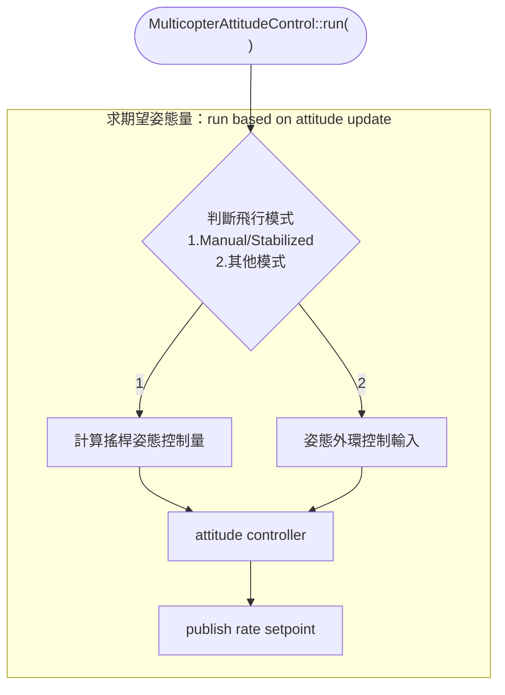
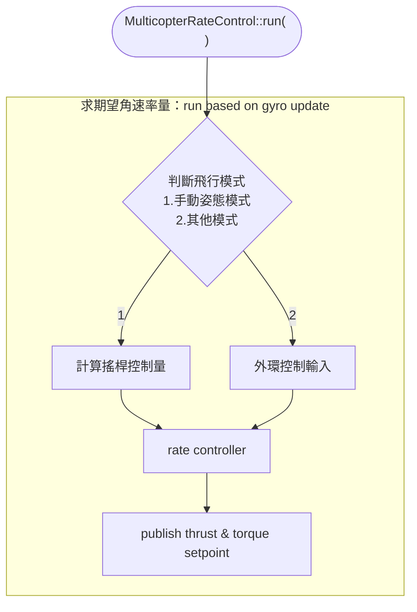

## Attitude controller

### Flow chart

```mermaid
graph TD

A(["MulticopterAttitudeControl::run( )"]) --> B{判斷飛行模式
1.Manual/Stabilized
2.其他模式}
subgraph "求期望姿態量：run based on attitude update"
B --> |1| 計算搖桿姿態控制量
B --> |2| 姿態外環控制輸入
計算搖桿姿態控制量 --> F[attitude controller]
姿態外環控制輸入 --> F
F --> G[publish rate setpoint]
end
```

### Attitude controller

## Rate controller

### Flow chart

```mermaid
graph TD

A(["MulticopterRateControl::run( )"]) --> B{判斷飛行模式
1.手動姿態模式
2.其他模式}
subgraph "求期望角速率量：run based on gyro update"
    B --> |1| D[計算搖桿控制量]
    B --> |2| E[外環控制輸入]
    D --> F[rate controller]
    E --> F
    F --> G[publish thrust & torque setpoint]
end
```

