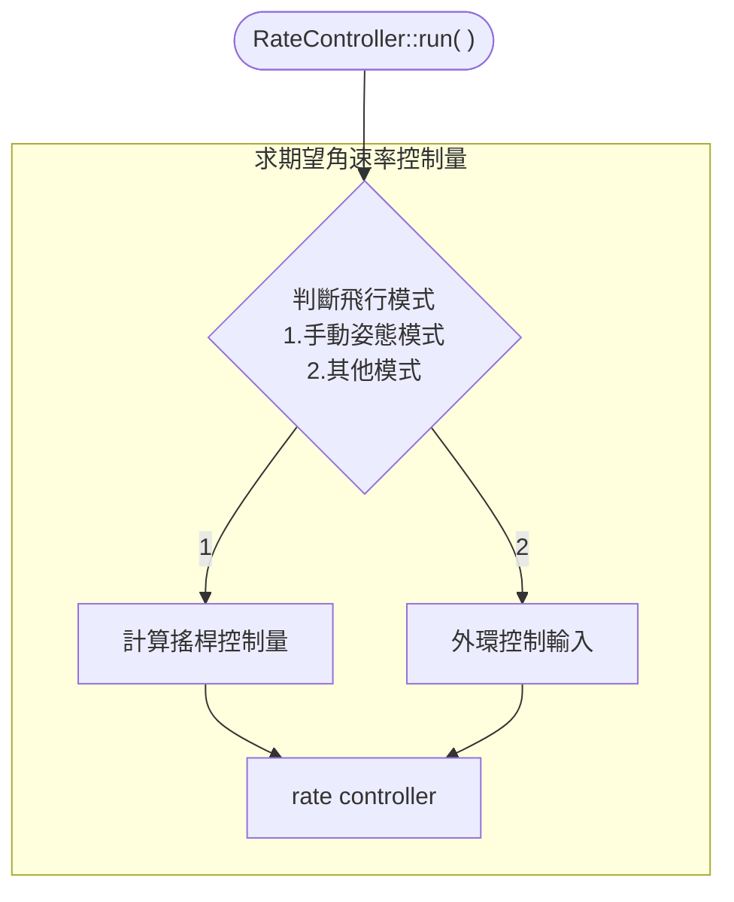

## Attitude controller

## Rate controller

```mermaid
graph TD

A(["RateController::run( )"]) --> B{判斷飛行模式
1.手動姿態模式
2.其他模式}
subgraph 求期望角速率控制量
    B --> |1| D[計算搖桿控制量]
    B --> |2| E[外環控制輸入]
    D --> F[rate controller]
    E --> F
end
```

